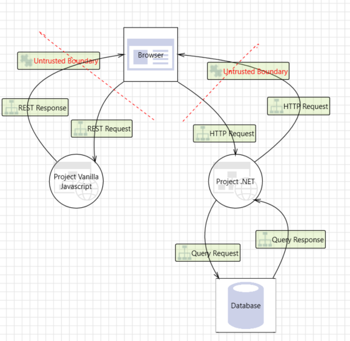

## Todo
- Wat is het nut 
- Waar zit je trust boundaries neer
- Wat hoort er wel en niet bij het threat model (bijv. externe sources)
- Wat doe je met de resultaten van de threatmodel
- Routing naar uitleg in TO beter beschrijven
- begrippenlijst

# Threat modeling
Threat modeling is een belangrijk onderdeel voor de ontwikkeling van veilige applicaties. Het doel is om beveiligingsrisico's vroeg in het ontwikkelingsproces te identificeren en passende maatregelen te nemen om deze risico's op te lossen

**Threat modeling biedt verschillende voordelen:**
1. **Proactieve beveiliging**: Door bedreigingen in een vroeg stadium te identificeren, kunnen ontwikkelaars beveiligingsmaatregelen implementeren voordat een systeem wordt ontwikkeld. Dit zorgt ervoor om de kans op beveiligingsincidenten te verkleinen.
2. **Kostenbesparing**: Het oplossen van beveiligingsproblemen tijdens de ontwerpfase is meestal minder kostbaar dan het oplossen van problemen nadat een systeem is geïmplementeerd.
3. **Verbeterde Kwaliteit**: Een goed uitgevoerd threat model kan helpen bij het verbeteren van de algehele kwaliteit van een systeem door zwakke plekken te identificeren en te versterken.
### Trust boundaries
Binnen een threat model worden trust boundaries gebruikt om grenzen van verschillende niveaus van vertrouwen binnen een applicatie aan te geven. Deze grenzen zijn cruciaal in threat modeling omdat ze helpen om de plekken te identificeren waar gegevens van de ene veiligheidszone naar de andere overgaan.
#### Soorten trust boundaries
- **Tussen een gebruiker en een webapplicatie**: Bijvoorbeeld waar een gebruiker inlogt op een website.
- **Binnen een applicatie**: Zoals tussen verschillende modules of microservices die verschillende niveaus van vertrouwelijkheid hebben.
- **Tussen systemen**: Bijvoorbeeld tussen een webserver en een database server.
#### Waar zet je ze neer
Het correct plaatsen van trust boundaries helpt bij het identificeren van kwetsbare punten waar extra beveiligingsmaatregelen nodig kunnen zijn.

Een goed voorbeeld van waar trust boundaries kunnen staan is tussen een browser en een applicatie. In het onderstaande voorbeeld ligt de trust boundary tussen de browser en `Project Vanilla Javascript` en `Project .NET`. Dit betekent dus dat tussen deze onderdelen een potentieel security risico aanwezig is. 

Wat opvallend is, is dat tussen `Project .NET` en `Database` geen trust boundary aanwezig is. Deze situatie gaat er dus vanuit dat de API endpoints de enige toegang tot het project zijn. In de praktijk kan het gebeuren dat iemand via de computer waar `Project .NET` op staat toegang krijgt tot de database. Volgens het onderstaande schema is dat niet mogelijk, maar in de praktijk kan het wel. Je zou er dus voor kunnen kiezen om tussen `Project .NET` en `Database` een trust boundary te zetten. Dit zorgt ervoor dat deze risico's ook worden meegenomen in het rapport en uiteindelijk in de genomen maatregelen

// Voorbeeld slecht

### Wat hoort er wel en niet bij het threat model?
**Bij het threat model horen:**
- **Actoren**: Identificatie van wie interactie heeft met het systeem (gebruikers, beheerders, aanvallers?, interne en externe systemen).
- **Assets**: Beschrijving van wat er beschermd moet worden (data, diensten, infrastructuur).
- **Bedreigingen**: Specifieke scenario's waarin een actor een asset kan bedreigen.
- **Mitigaties**: Bestaande of geplande beveiligingsmaatregelen die deze bedreigingen kunnen verminderen.

**Niet bij het threat model horen:**
- **Gedetailleerde implementatie-specificaties**: Threat modeling richt zich op de architectuur en het ontwerp, niet op de daadwerkelijke code.
- **Externe bronnen zonder invloed op het systeem**: Elementen die geen directe interactie of impact op het systeem hebben, worden meestal buiten beschouwing gelaten.
## Wat doe je met de resultaten van het threat model?
De resultaten van een threat model zorgt voor waardevolle inzichten die direct gebruikt kunnen worden om de beveiliging van een systeem te verbeteren. 

De belangrijkste stappen na het opstellen van een threat model zijn:
1. **Risicoanalyse**: Prioriteren van de geïdentificeerde bedreigingen op basis van hun #waarschijnlijkheid en #impact.
2. **Mitigatieplanning**: Ontwikkelen van plannen en maatregelen om de geïdentificeerde risico's te verminderen.
3. **Beveiligingsmaatregelen implementeren**: Implementeren van de beveiligingsmaatregelen in het ontwikkelingsproces.
4. **Continu monitoren en updaten**: Het threat model regelmatig bijwerken om nieuwe bedreigingen en veranderingen in het systeem aan te pakken.
### Risico analyse
Risicoanalyse houdt in dat de geïdentificeerde bedreigingen worden geprioriteerd op basis van hun waarschijnlijkheid en impact. Dit helpt om te bepalen welke bedreigingen de grootste risico's vormen en dus als eerste moeten worden aangepakt.

Meer over de risico analyse is te vinden in #riskassesment
### Mitigatieplanning
Mitigatieplanning gaat over het ontwikkelen van gedetailleerde plannen en maatregelen om de geïdentificeerde risico's te verminderen. Dit kan variëren van technische oplossingen zoals encryptie en toegangscontrole tot organisatorische maatregelen zoals training en bewustwording.
### Beveiligingsmaatregelen implementeren
Het implementeren van beveiligingsmaatregelen houdt in dat de geplande maatregelen daadwerkelijk worden geïntegreerd in het ontwikkelingsproces van het systeem. Dit kan het schrijven van veilige code, het configureren van beveiligingsinstellingen, en het gebruik van beveiligingstools en -services omvatten.
### Continu monitoren en updaten
Continu monitoren en updaten houdt in dat het threat model regelmatig wordt herzien en bijgewerkt om nieuwe bedreigingen en veranderingen in het systeem aan te pakken. Dit is essentieel om ervoor te zorgen dat het systeem veerkrachtig blijft tegen nieuwe en opkomende bedreigingen.

## Tools voor threat modeling

## Begrippenlijst
- **Threat Modeling**: Een proces om beveiligingsrisico's te identificeren en te mitigeren.
- **Trust Boundary**: Grenzen binnen een systeem die verschillende niveaus van vertrouwen vertegenwoordigen.
- **Actor**: Een gebruiker, systeem of proces dat interactie heeft met een systeem.
- **Asset**: Iets van waarde binnen het systeem dat beschermd moet worden.
- **Mitigatie**: Een maatregel die genomen wordt om een beveiligingsbedreiging te verminderen of elimineren.
- **STRIDE**: Een methodiek voor het categoriseren van bedreigingen (Spoofing, Tampering, Repudiation, Information Disclosure, Denial of Service, Elevation of Privilege).